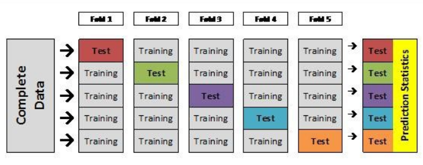
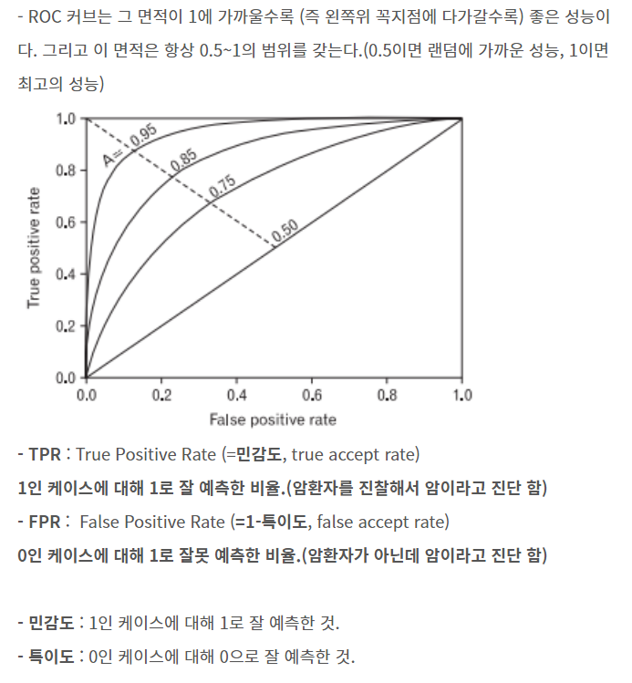

```{r setup, include=FALSE}
knitr::opts_chunk$set(echo=T, fig.align = "center", message=F, warning=F, fig.height = 8, cache=T, dpi = 300, dev = "png")
```


# 사용자 기반의 추천시스템 모델링

## I 분석환경설정
```{r}
library(data.table)
library(tidyverse)
library(dplyr)
library(ggplot2)
library(recommenderlab)
#help(package="recommenderlab")

r <- read.csv("./data/ratings.csv", header=T)
mr <- read.csv("./data/mr.csv", header=T)
final_mr <- spread(mr, key = "title", value = "rating", fill = NA)
final_mr <- final_mr[,-1]
```

```{r}
knitr::kable(head(mr))
#knitr::kable(head(mr[order(mr$userId),]))
#knitr::kable(head(mr[order(mr$rating),]))
knitr::kable(table(r$rating))

df <- as(final_mr, 'matrix') 
df <- as(df, 'realRatingMatrix')
```


## II
  - 분석 데이터 : 'mr' dataset
  - 분석 기법 : 사용자 평점을 이용한 사용자 기반 협업 필터링 알고리즘(UBCF)
  
```{r}
set.seed(2021)
index <- sample(1:nrow(df), size = nrow(df)*0.7)

train <- df[index, ]
test  <- df[-index,]

model1 <- Recommender(train, method = "UBCF")
model1

pre <- predict(model1, newdata=test[1], n=10) #test 1 ~ 183
# as(pre, "list")

# just check
pre_list <- sapply(pre@items, function(x) {colnames(train)[x]})
table(unlist(lapply(pre_list, length)))
knitr::kable(pre_list[])
```
데이터를 7:3 비율로 train 과 test 데이터셋으로 분할한다.
먼저 파라미터를 신경 쓰지 않고 간단한 사용자 기반의 추천 시스템 모델링을 구현한다. 구현된 모형 rec를 가지고 추천 영화 10개를 출력한다. - 리스트를 벡터에 담아서 워드클라우드로 시각화

```{r}
# 유사도
similarity_mat <- similarity(train[1:10,], method = "cosine", which = "users")
as.matrix(similarity_mat)
image(as.matrix(similarity_mat), main = "user's similiarity")

# 히트맵
image(train[1:30,1:30], axes=FALSE, main = "10 x 10 heatmap")

# top
movie_ratings <- train[rowCounts(train) > 50, colCounts(train) > 50]
movie_ratings

minimum_movies <- quantile(rowCounts(movie_ratings), 0.98)
minimum_users <- quantile(colCounts(movie_ratings), 0.98)
image(movie_ratings[rowCounts(movie_ratings) > minimum_movies,
                    colCounts(movie_ratings) > minimum_users],
      main = "Heatmap of the top users and movies")


## 데이터..
# qplot(table(r$rating), fill=I("steelblue"), col=I("red")) +
#   ggtitle("A distribution of the average rating per user")

# heatmap of normalized value
# image(normalized_ratings[rowCounts(normalized_ratings) > minimum_movies,
#       colCounts(normalized_ratings) > minimum_users],
#       main = "Normailized ratings of the top users")

```

```{r}
# 데이터 조정 후 재학습
table(rowCounts(df))
mean(rowCounts(df))
data_modify <- df[rowCounts(df) <= 165.2918]
dim(data_modify)

boxplot(Matrix::rowMeans(data_modify), horizontal=T)
```

```{r}
model1 <- Recommender(train, method = "RANDOM")
model2 <- Recommender(train, method = "POPULAR")
model3 <- Recommender(train, method = "UBCF")
model4 <- Recommender(train, method = "IBCF")
model5 <- Recommender(train, method = "SVD")

pre <- predict(model1, newdata=test[1], n=10) #test 1 ~ 183
# as(pre, "list")

# just check
pre_list <- sapply(pre@items, function(x) {colnames(train)[x]})
table(unlist(lapply(pre_list, length)))
knitr::kable(pre_list[])
```

```{r}
eval_sets <- evaluationScheme(data = data_modify,
                              method = "cross-validation",
                              train = 0.7,
                              k = 10,
                              goodRating = 3,
                              given = 10)

n_recommendations = c(1,5,seq(10,100,10))

# Training dataset modeling
model1 <- Recommender(data = getData(eval_sets, "train"),
                           method = "UBCF", 
                           parameter = NULL)
model1

# Prediction
pred_eval <- predict(model1, 
                     newdata = getData(eval_sets, "known"),
                     n = 10, type = "ratings")
pred_eval
```

```{r}
# Calculate accuracy
accuracy_model1 <- calcPredictionAccuracy(x=pred_eval,
                                        data=getData(eval_sets, "unknown"),
                                        byUser=T)
head(accuracy_model1, 10)
colMeans(accuracy_model1)

# Calculate accuracy 2
# ?evaluate
algorithms <- list(
  
  RANDOM = list(name = "RANDOM", param = NULL),
  POPULAR = list(name = "POPULAR", param = NULL),
  HYBRID = list(name = "HYBRID", param =
      list(recommenders = list(
        RANDOM = list(name = "RANDOM", param = NULL),
        POPULAR = list(name = "POPULAR", param = NULL))))
)
result <- evaluate(eval_sets, algorithms, n=n_recommendations)
result
avg(result) #precision(정밀도), recall(재현율)
```

```{r}
plot(result, annotate=T, legend="right", main = "ROC Curve")
plot(result, "prec/rec", annotate=T,legend="right") #bad.. 
# plot(result2, annotate=T, legend="topleft")
# plot(result2, "prec/rec", annotate=T,legend="topleft")

#따로 평가해서 result값 넣은 후 비교
#정밀도 재현율 곡선 해설 find
```

> 함수설명

[evaluationScheme](https://www.rdocumentation.org/packages/recommenderlab/versions/0.2-7/topics/evaluationScheme)

[HybridRecommender](https://rdrr.io/cran/recommenderlab/man/HybridRecommender.html)



[ROC EXPLAIN LINK1](https://newsight.tistory.com/53)
[ROC EXPLAIN LINK2](https://angeloyeo.github.io/2020/08/05/ROC.html)

---

# 아이템 기반의 추천시스템 모델링
```{r, warning=F}
mg <- read.csv('./data/mg.csv', header=T)
final_mg <- spread(mg, key = "genres", value = "value", fill = NA)
final_mg <- final_mg[,-c(1,2)]
```

```{r}
knitr::kable(head(mg))
knitr::kable(table(mg$genres))

df2 <- as(final_mg, 'matrix') 
df2 <- as(df2, 'realRatingMatrix')
```

## 분석환경설정 I
  - 분석 데이터 : 'mg' dataset
  - 분석 기법 : 영화 자체 정보를 이용한 아이템 기반 협업 필터링 알고리즘(IBCF)
  
```{r, eval=F}
set.seed(2021)
index <- sample(1:nrow(df2), size = nrow(df2)*0.7)

train <- df2[index, ]
test  <- df2[-index,]

model1 <- Recommender(train, method = "IBCF")
model1

pre <- predict(model1, newdata=test[1], n=10) #test 1 ~ 183
# as(pre, "list")

# just check
pre_list <- sapply(pre@items, function(x) {colnames(train)[x]})
table(unlist(lapply(pre_list, length)))
knitr::kable(pre_list[])
```


```{r, eval=F}
# 데이터 조정 후 재학습
table(rowCounts(df2))
mean(rowCounts(df2))
data_modify <- df2[rowCounts(df2) <= 2.266886]
dim(data_modify)

boxplot(Matrix::rowMeans(data_modify), horizontal=T)
# 아IBCF 알고리즘으로는 장르기반 별로?

eval_sets <- evaluationScheme(data = data_modify,
                              method = "cross-validation",
                              train = 0.7,
                              k = 3,
                              #goodRating = 3,
                              given = 1)

n_recommendations = c(1,5,seq(10,100,10))

# Training dataset modeling
model1 <- Recommender(data = getData(eval_sets, "train"),
                           method = "IBCF", 
                           parameter = NULL)
model1

# Prediction
pred_eval <- predict(model1, 
                     newdata = getData(eval_sets, "known"),
                     n = 10, type = "ratings")
pred_eval
```

```{r, eval=F}
# Calculate accuracy
accuracy_model1 <- calcPredictionAccuracy(x=pred_eval,
                                        data=getData(eval_sets, "unknown"),
                                        byUser=T)
head(accuracy_model1, 10)
colMeans(accuracy_model1)

# Calculate accuracy 2
# ?evaluate
algorithms <- list(
  
  RANDOM = list(name = "RANDOM", param = NULL),
  POPULAR = list(name = "POPULAR", param = NULL),
  HYBRID = list(name = "HYBRID", param =
      list(recommenders = list(
        RANDOM = list(name = "RANDOM", param = NULL),
        POPULAR = list(name = "POPULAR", param = NULL))))
)
result <- evaluate(eval_sets, algorithms, n=n_recommendations)
result
avg(result) #precision(정밀도), recall(재현율)
```

```{r, eval=F}
plot(result, annotate=T, legend="right", main = "ROC Curve")
plot(result, "prec/rec", annotate=T,legend="right") #bad.. 
# plot(result2, annotate=T, legend="topleft")
# plot(result2, "prec/rec", annotate=T,legend="topleft")

#따로 평가해서 result값 넣은 후 비교
#정밀도 재현율 곡선 해설 find
```


---

# 고려사항

  - 패키지 내 다양한 함수들을 보다 적절하게 사용하기 위해 이론 학습은 필요하다.

  - 위 패키지는 지속적으로 업그레이드가 되고 있기 때문에 [Reference Manual](https://cran.r-project.org/web/packages/recommenderlab/recommenderlab.pdf)을 활용한다.

---

# 문제점

---

# 희망사항

  - R과 R shiny를 활용한 추천시스템 구현
  - sample: https://andreasvoglstatworx.shinyapps.io/apptest/


